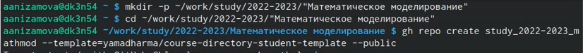
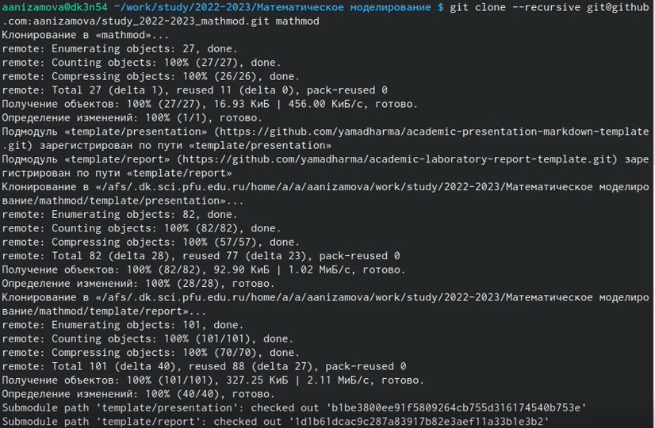
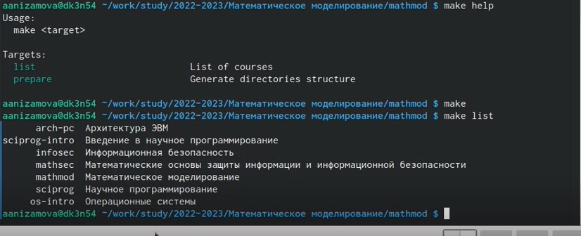
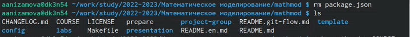
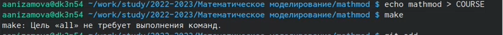
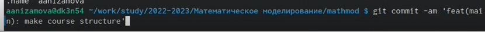
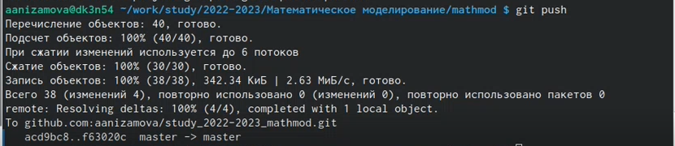

---
## Front matter
lang: ru-RU
title: Лабораторная работа №1
author:
  - Низамова А. А.
institute:
  - Российский университет дружбы народов, Москва, Россия
date: 11 февраля 2023

## i18n babel
babel-lang: russian
babel-otherlangs: english

## Formatting pdf
toc: false
toc-title: Содержание
slide_level: 2
aspectratio: 169
section-titles: true
theme: metropolis
header-includes:
 - \metroset{progressbar=frametitle,sectionpage=progressbar,numbering=fraction}
 - '\makeatletter'
 - '\beamer@ignorenonframefalse'
 - '\makeatother'
---

# Информация

## Докладчик

:::::::::::::: {.columns align=center}
::: {.column width="70%"}

  * Низамова Альфия Айдаровна
  * студент
  * Российский университет дружбы народов
  * [1032201670@pfur.ru]
:::
::: {.column width="30%"}

## Цели и задачи

- Создать рабочее пространство для лабораторной работы
- Настроить репозиторий курса

## Материалы и методы

- Процессор `pandoc` для входного формата Markdown
- Результирующие форматы
	- `pdf`
	- `html`
- Автоматизация процесса создания: `Makefile`

# Создание рабочего пространства для л. р.

Создала репозиторий курса с помощью утилит
(рис.1)
{#fig:001 width=70%}

Склонировала его (рис.2)
{#fig:002 width=70%}

Посмотрела доступные цели make и список доступных курсов (рис.3)
{#fig:003 width=70%}

# Настройка каталога курса:
Удалила лишние файлы (рис.4)
{#fig:004 width=70%}

Создала необходимые каталоги (рис. 5)
{#fig:005 width=70%}

Отравила файлы на сервер (рис. 6)
{#fig:006 width=70%}
{#fig:007 width=70%}
{#fig:008 width=70%}
