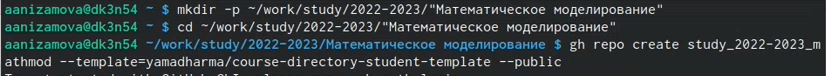
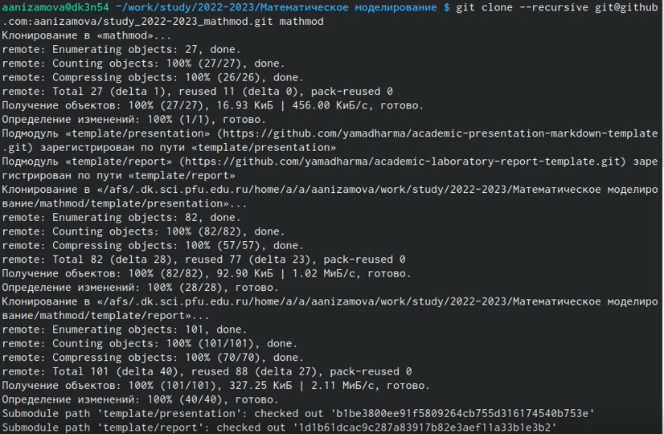
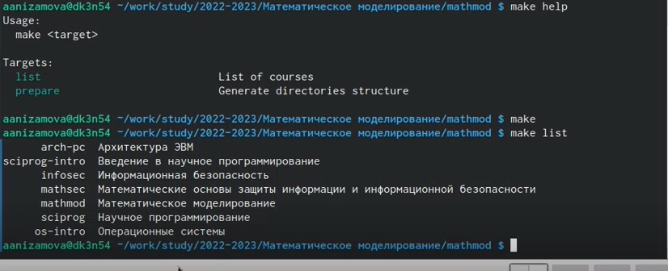
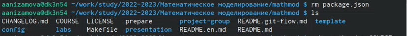
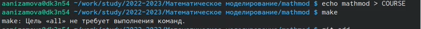
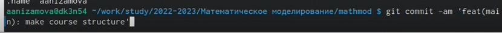
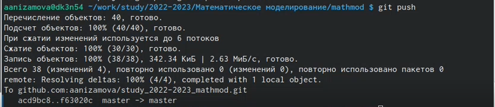

---
## Front matter
title: "Шаблон отчёта по лабораторной работе"
subtitle: "Простейший вариант"
author: "Дмитрий Сергеевич Кулябов"

## Generic otions
lang: ru-RU
toc-title: "Содержание"

## Bibliography
bibliography: bib/cite.bib
csl: pandoc/csl/gost-r-7-0-5-2008-numeric.csl

## Pdf output format
toc: true # Table of contents
toc-depth: 2
lof: true # List of figures
lot: true # List of tables
fontsize: 12pt
linestretch: 1.5
papersize: a4
documentclass: scrreprt
## I18n polyglossia
polyglossia-lang:
  name: russian
  options:
	- spelling=modern
	- babelshorthands=true
polyglossia-otherlangs:
  name: english
## I18n babel
babel-lang: russian
babel-otherlangs: english
## Fonts
mainfont: PT Serif
romanfont: PT Serif
sansfont: PT Sans
monofont: PT Mono
mainfontoptions: Ligatures=TeX
romanfontoptions: Ligatures=TeX
sansfontoptions: Ligatures=TeX,Scale=MatchLowercase
monofontoptions: Scale=MatchLowercase,Scale=0.9
## Biblatex
biblatex: true
biblio-style: "gost-numeric"
biblatexoptions:
  - parentracker=true
  - backend=biber
  - hyperref=auto
  - language=auto
  - autolang=other*
  - citestyle=gost-numeric
## Pandoc-crossref LaTeX customization
figureTitle: "Рис."
tableTitle: "Таблица"
listingTitle: "Листинг"
lofTitle: "Список иллюстраций"
lotTitle: "Список таблиц"
lolTitle: "Листинги"
## Misc options
indent: true
header-includes:
  - \usepackage{indentfirst}
  - \usepackage{float} # keep figures where there are in the text
  - \floatplacement{figure}{H} # keep figures where there are in the text
---

# Цель работы

Создание рабочего пространства для лабораторной работы и создание репозитория курса.

# Задание

Создать рабочее пространство для лабораторной работы.
Создать репозиторий курса.

# Теоретическое введение
Сознание репозитория курса на основе шаблона

    Репозиторий на основе шаблона можно создать либо вручную, через web-интерфейс, либо с помощью утилит gh.

Создание с помощью утилит

    Создание выглядит следующим образом:

    gh repo create <new-repo-name> --template="<owner/template-repo>"

    Например, для 2022–2023 учебного года и предмета «Математическое моделирование» (аббревиатура предмета — mathmod) создание репозитория примет следующий вид:

    mkdir -p ~/work/study/2022-2023/"Математическое моделирование"
    cd ~/work/study/2022-2023/"Математическое моделирование"
    gh repo create study_2022-2023_mathmod --template=yamadharma/course-directory-student-template --public
    git clone --recursive git@github.com:<owner>/study_2022-2023_mathmod.git mathmod

Создание вручную

    Сделать свой репозиторий на основе шаблона можно и вручную: https://docs.github.com/en/repositories/creating-and-managing-repositories/creating-a-repository-from-a-template.

# Выполнение лабораторной работы

Создала репозиторий курса с помощью утилит
(рис.1)
{#fig:001 width=70%}

Склонировала его (рис.2)
{#fig:002 width=70%}

Посмотрела доступные цели make и список доступных курсов (рис.3)
{#fig:003 width=70%}

Настроила каталог курса:
Удалила лишние файлы (рис.4)
{#fig:004 width=70%}

Создала необходимые каталоги (рис. 5)
{#fig:005 width=70%}

Отравила файлы на сервер (рис. 6)
{#fig:006 width=70%}
{#fig:007 width=70%}
{#fig:008 width=70%}

# Выводы

Я создала рабочее пространство для лабораторной работы и репозиторий курса.

# Список литературы{.unnumbered}

::: {#refs}
:::
