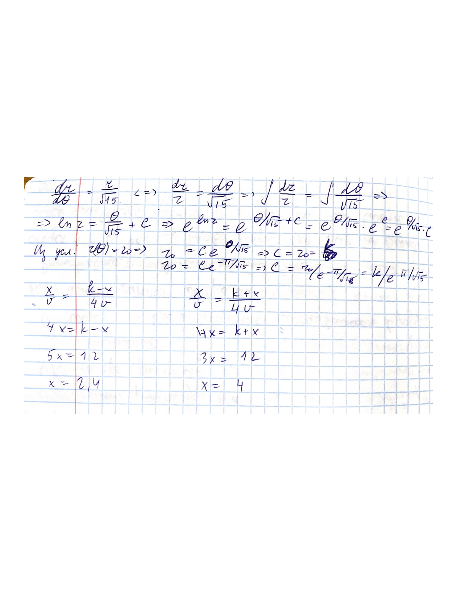
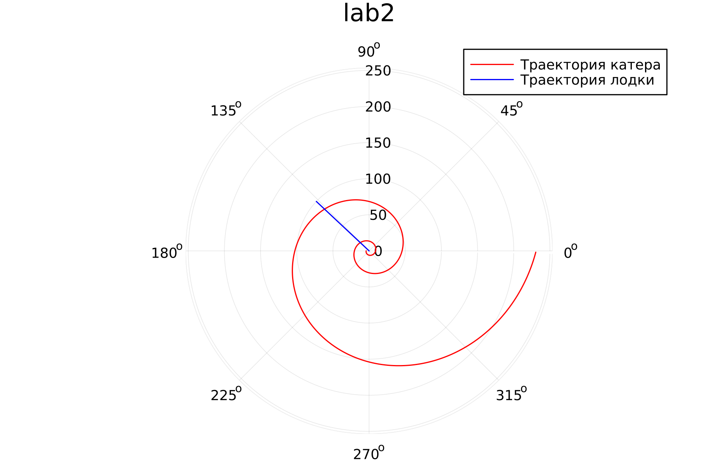

---
## Front matter
lang: ru-RU
title: " Лабораторная работа №2. Задача о погоне "
author: |
	 "Низамова Альфия Айдаровна. НФИбд-01-20"\inst{1}

institute: |
	\inst{1}Российский Университет Дружбы Народов

date: 18 февраля, 2023, Москва, Россия

## Formatting
mainfont: PT Serif
romanfont: PT Serif
sansfont: PT Sans
monofont: PT Mono
toc: false
slide_level: 2
theme: metropolis
header-includes: 
 - \metroset{progressbar=frametitle,sectionpage=progressbar,numbering=fraction}
 - '\makeatletter'
 - '\beamer@ignorenonframefalse'
 - '\makeatother'
aspectratio: 43
section-titles: true

---

# Цели и задачи работы

## Цель работы:

Разобраться в алгоритме построения математической модели на примере задачи о погоне. 
Также необходимо провести теоритические рассуждение и вывести дифференциальные уравнения, с помощью которых мы сможем определить точку пересечения лодки и катера. 

# Задачи:

1. Изучить условие задачи о погоне
2. Провести рассуждения и вывести дифференциальные уравнения 
3. Построить траекторию движение катера и лодки для двух случаев
4. Определить по графику точку пересечения катера и лодки

# Ход работы лабораторной работы

## Условие задачи:
Вариант 2: На море в тумане катер береговой охраны преследует лодку браконьеров.
Через определенный промежуток времени туман рассеивается, и лодка
обнаруживается на расстоянии 12 км от катера. Затем лодка снова скрывается в
тумане и уходит прямолинейно в неизвестном направлении. Известно, что скорость
катера в 4 раза больше скорости браконьерской лодки.

## Теоретический материал 

Принимаем за $t_0=0, X_0=0$  - место нахождения лодки браконьеров в момент, когда их обнаруживают катера береговой охраны. После вводим полярные координаты.
Время, за которое они пройдут это расстояние, вычисляется как $\frac{x}{υ}$ или $\frac{x+k}{υ}$ (для второго случая $\frac{x-k}{υ}$).  Так как время одно и то же, то эти величины одинаковы. 
Тогда неизвестное расстояние можно найти из следующего уравнения:  $\frac{x}{υ} = \frac{x+k}{υ}$ - в первом случае, $\frac{x}{υ} =  \frac{x-k}{υ}$ во втором случае.

## Теоретический материал 

Отсюда находим два значения $x_1$ и $x_2$, задачу будем решать для двух случаев : 

*$x_1=\frac{k}{n+1}$ ,при $\theta=0$

*$x_2=\frac{k}{n-1}$ ,при $\theta=-\pi$

## Теоретический материал 
Находим тангенциальную скорость для нашей задачи $υ_t=r\frac{d\theta}{dt}$.
Вектора образуют прямоугольный треугольник, откуда по теореме Пифагора можно найти тангенциальную скорость $υ_t= \sqrt{n^2 υ_r^2-v^2}$. Поскольку, радиальная скорость равна $υ$, то тангенциальную скорость находим из уравнения $υ_t= \sqrt{n^2 υ^2-υ^2 }$. Следовательно, $υ_τ=υ\sqrt{n^2-1}$.

* Тогда получаем $r\frac{d\theta}{dt}=υ\sqrt{n^2-1}$

## Теоретические рассчеты: 
{ #fig:002 width=80% height=80% }

## Теоретический материал(продолжение)
Исключая из полученной системы производную по t, можно перейти к следующему уравнению: $\frac{dr}{d\theta}=\frac{r}{\sqrt{n^2-1}}$
Начальные условия остаются прежними. Решив это уравнение, мы получим траекторию движения катера в полярных координатах. 

## Результаты работы программы
Точка пересечения красного и синего графиков является точкой пересечения катера береговой охраны и лодки браконьеров. 

{ #fig:004 width=80% height=80% }

## Результаты работы программы
Точка пересечения красного и синего графиков является точкой пересечения катера береговой охраны и лодки браконьеров. 

{ #fig:005 width=80% height=80% }

# Выводы
В ходе лабораторной работы нам удалось рассмотреть задачу о погоне, составить и решить дифференциальные уравнения. Смоделировать ситуацию и сделать вывод о том, что в первом случае погоня завершиться раньше.
