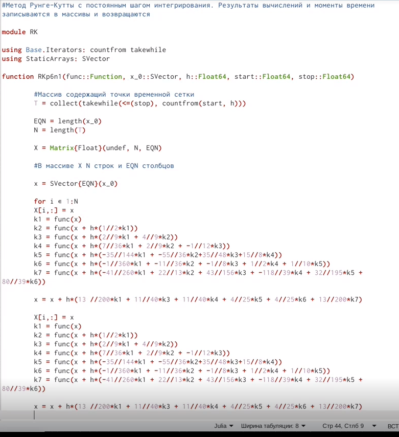
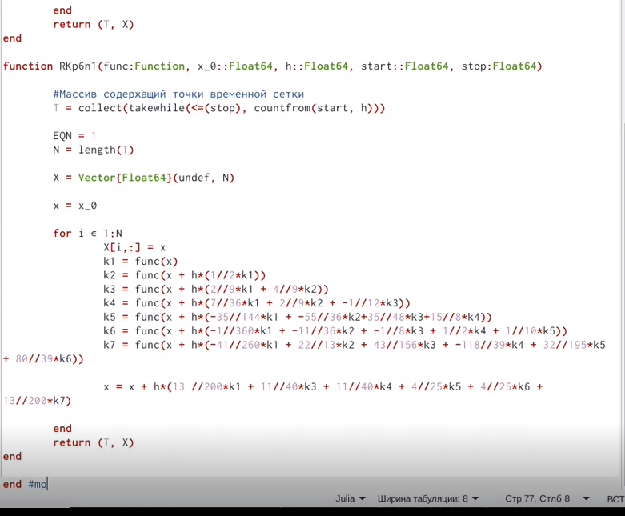
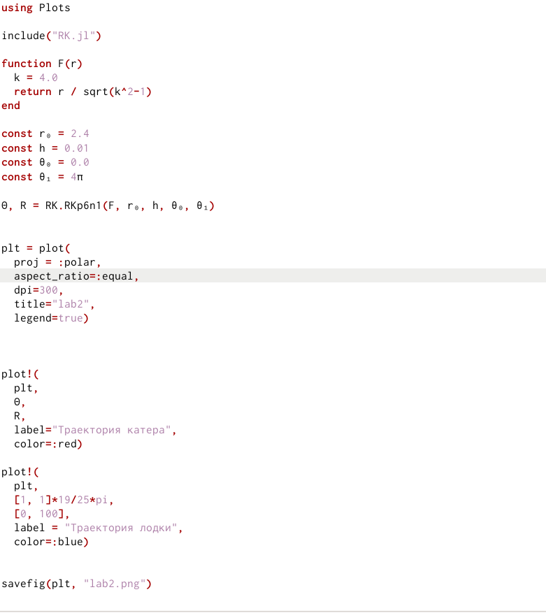
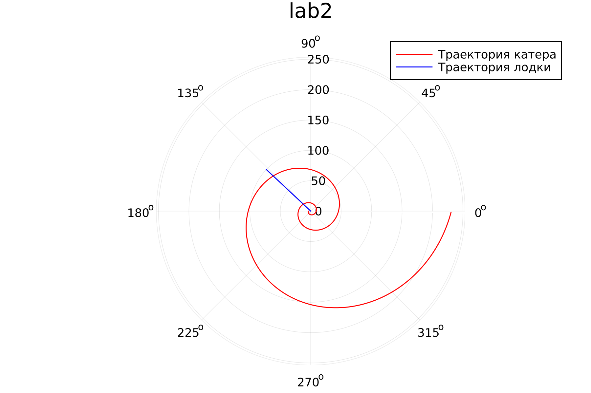
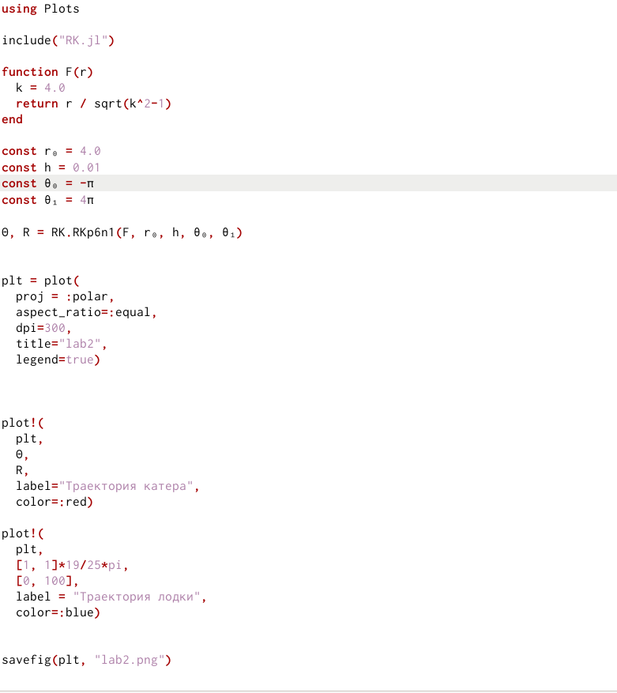
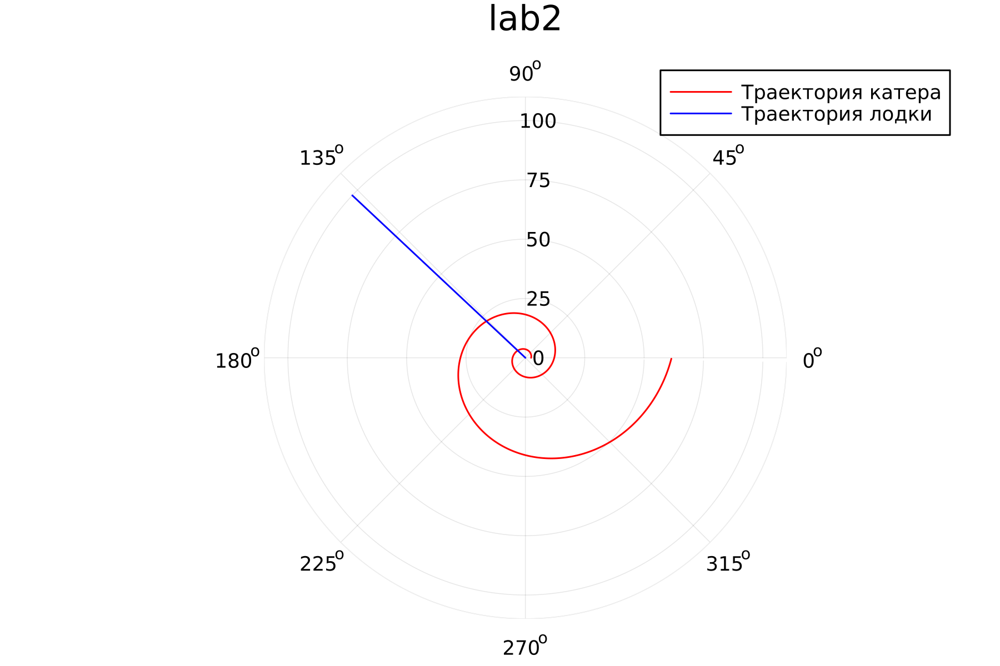

---
# Front matter
lang: ru-RU
title: "Отчёт по лабораторной работе №2"
subtitle: "Задача о погоне"
author: "Низамова Альфия Айдаровна"

# Formatting
toc-title: "Содержание"
toc: true # Table of contents
toc_depth: 2
lof: true # List of figures
lot: true # List of tables
fontsize: 12pt
linestretch: 1.5
papersize: a4paper
documentclass: scrreprt
polyglossia-lang: russian
polyglossia-otherlangs: english
mainfont: PT Serif
romanfont: PT Serif
sansfont: PT Sans
monofont: PT Mono
mainfontoptions: Ligatures=TeX
romanfontoptions: Ligatures=TeX
sansfontoptions: Ligatures=TeX,Scale=MatchLowercase
monofontoptions: Scale=MatchLowercase
indent: true
pdf-engine: lualatex
header-includes:
  - \linepenalty=10 # the penalty added to the badness of each line within a paragraph (no associated penalty node) Increasing the value makes tex try to have fewer lines in the paragraph.
  - \interlinepenalty=0 # value of the penalty (node) added after each line of a paragraph.
  - \hyphenpenalty=50 # the penalty for line breaking at an automatically inserted hyphen
  - \exhyphenpenalty=50 # the penalty for line breaking at an explicit hyphen
  - \binoppenalty=700 # the penalty for breaking a line at a binary operator
  - \relpenalty=500 # the penalty for breaking a line at a relation
  - \clubpenalty=150 # extra penalty for breaking after first line of a paragraph
  - \widowpenalty=150 # extra penalty for breaking before last line of a paragraph
  - \displaywidowpenalty=50 # extra penalty for breaking before last line before a display math
  - \brokenpenalty=100 # extra penalty for page breaking after a hyphenated line
  - \predisplaypenalty=10000 # penalty for breaking before a display
  - \postdisplaypenalty=0 # penalty for breaking after a display
  - \floatingpenalty = 20000 # penalty for splitting an insertion (can only be split footnote in standard LaTeX)
  - \raggedbottom # or \flushbottom
  - \usepackage{float} # keep figures where there are in the text
  - \floatplacement{figure}{H} # keep figures where there are in the text
---

# Цель работы

Разобраться в алгоритме построения математической модели на примере задачи о погоне. 
Также необходимо провести теоритические рассуждение и вывести дифференциальные уравнения, с помощью которых мы сможем определить точку пересечения лодки и катера.

# Библиография
1. [Git - система контроля версий](https://github.com/)

2. [Дифференциальные уравнения](https://ru.wikipedia.org/wiki/Дифференциальное_уравнение)

3. [Язык программирования - Julia](https://julialang.org/)

4. [Установка Julia](https://julialang.org/downloads/)

5. [Создание Plot в Julia](https://docs.juliaplots.org/latest/tutorial/#plotting-backends)

# Задачи лабораторной работы

1. Изучить условие задачи о погоне
2. Провести рассуждения и вывести дифференциальные уравнения 
3. Построить траекторию движение катера и лодки для двух случаев
4. Определить по графику точку пересечения катера и лодки

# Выполнение лабораторной работы

1. Определила номер своего варинта по формуле: ((ст_билет)mod70) + 1 = (1032201670 mod 70) + 1 = 2 

2. Учитывая, что лодка обнаруживается на расстоянии 12 км от катера, а скорость катера в 4 раза больше скорости браконьерской лодки (вариант 2), провела вычисления и получила начальные значения:

r0 = 0
x1 = 2.4

r0 = -pi
x2 = 4

3. Переходим к написанию кода на языке программирования Julia. Написала код для метода Рунгк-Кутты с постоянным шагом интегрирования

*Рис.1 "RK_1"*

*Рис.2 "RK_1"*

4. Рассматриваем два случая. 

    Первый:
    начальное значение: 2.4
    сохраняем изображение: lab2_1.png

*Рис.3 "Code_1"*

Получаем следующий график:

*Рис.4 "График для первого случая"*

    Второй:
    начальное значение: 4
    сохраняем изображение: lab2.png

*Рис.5 "Code_2"*

Получаем следующий график:

*Рис.4 "График для второго случая"*

6. Исходя из полученных графиков, мы видим, что в первом случае катер быстрее догонит лодку с браконьерами (при начальном значении 2,4). Точка пересечения красного и синего графиков и есть ответ.

# Выводы

В ходе лабораторной работы нам удалось рассмотреть задачу о погоне,составить и решить дифференциальные уравнения. Смоделировать ситуацию и сделать вывод о том, что в первом случае погоня завершиться раньше. 
