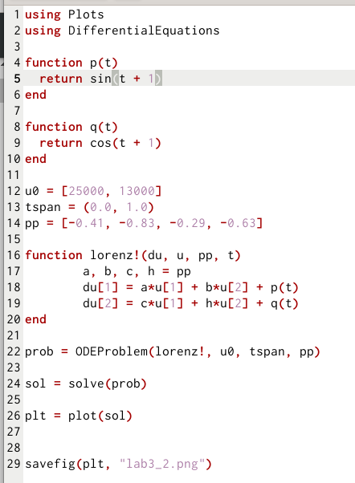
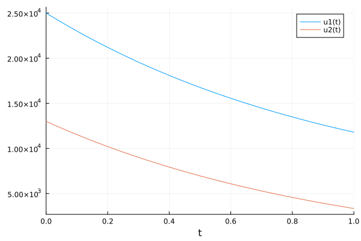
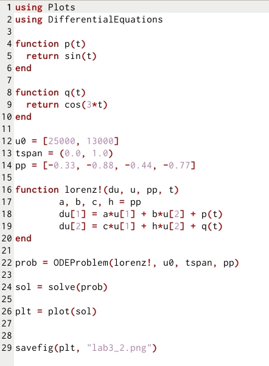
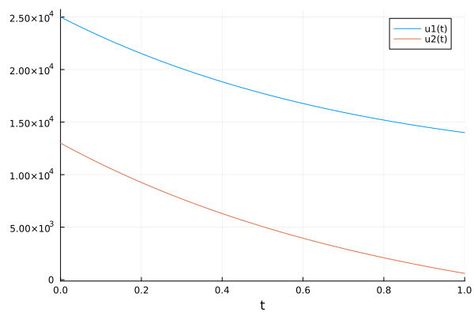
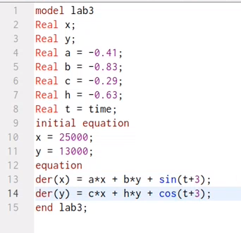
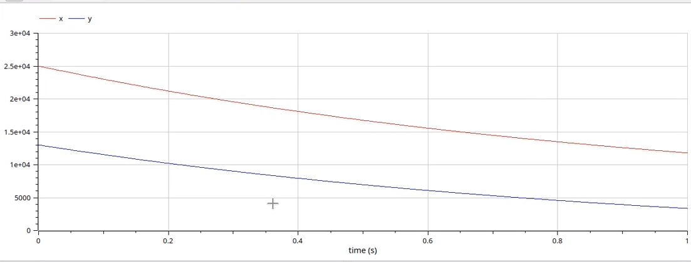
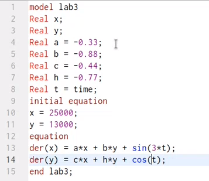
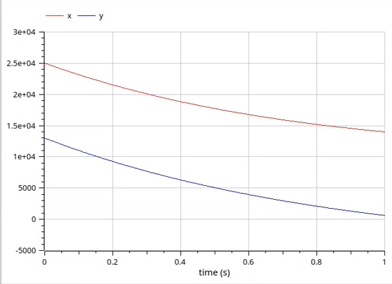

---
## Front matter
lang: ru-RU
title: " Лабораторная работа №3"
author: |
	 "Низамова Альфия Айдаровна. НФИбд-01-20"\inst{1}

institute: |
	\inst{1}Российский Университет Дружбы Народов

date: 18 февраля, 2023, Москва, Россия

## Formatting
mainfont: PT Serif
romanfont: PT Serif
sansfont: PT Sans
monofont: PT Mono
toc: false
slide_level: 2
theme: metropolis
header-includes: 
 - \metroset{progressbar=frametitle,sectionpage=progressbar,numbering=fraction}
 - '\makeatletter'
 - '\beamer@ignorenonframefalse'
 - '\makeatother'
aspectratio: 43
section-titles: true

---

# Цели и задачи работы

## Цель работы:

Целью данной лабораторной работы является построение моделей боевых действий на языках программирования Julia и OpenModelica 

# Задачи:

1. Изучить условие задачи
2. Написать код на языке программирования Julia для двух случаев 
3. Написать код на языке программирования OpenModelica для двух случаев
4. Изучить полученные графики

# Ход работы лабораторной работы

## Условие задачи:
Вариант 2: Между страной Х и страной У идет война. Численность состава войск
исчисляется от начала войны, и являются временными функциями
x(t) и y(t). В начальный момент времени страна Х имеет армию численностью 25 000 человек, а
в распоряжении страны У армия численностью в 13 000 человек. Для упрощения модели считаем, что коэффициенты a, b, c, h постоянны. Также считаем P(t) и Q(t) непрерывные функции.
Постройте графики изменения численности войск армии Х и армии У для следующих случаев:
1. Модель боевых действий между регулярными войсками: 
dx/dt = -0,41x(t)-0,83y(t)+sin(t+3)
dy/dt = -0,29x(t)-0,63y(x)+cos(t+3)
2. Модель ведение боевых действий с участием регулярных войск и
партизанских отрядов
dx/dt = -0,33x(t)-0,88y(t)+sin(t)
dy/dt = -0,44x(t)-0,77y(x)+cos(3t)

## Julia

Написала код на языке Julia для модели боевых действий между регулярными войсками 
{#fig:001 width=70%}

## Julia 

Результат выполнения программы

## Julia 
Написала код на языке Julia для модели боевых действий с участием регулярных войск и партизанских отрядов (рис.3)
{#fig:001 width=70%}

## Julia 
Результат выполнения программы(рис.4)
{#fig:001 width=70%}

## OpenModelica
Написала код на яхыке OpenModelica для модели боевых действий между регулярными войсками (рис.1)
{#fig:001 width=70%}

## OpenModelica
Результат выполнения программы(рис.2)
{#fig:001 width=70%}

## OpenModelica
Написала код на языке OpenModelica для модели боевых действий с участием регулярных войск и партизанских отрядов (рис.3)
{#fig:001 width=70%}

## OpenModelica
Результат выполнения программы(рис.4)
{#fig:001 width=70%}

# Выводы
В ходе лабораторной работы нам удалось рассмотреть задачу, построить модель боевых действий на языках программирования Julia и OpenModelica. Смоделировать ситуацию и сделать вывод о том, что в во всех случаях страна Х победит.
