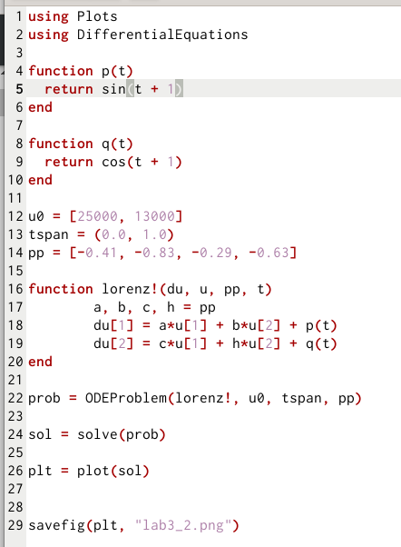
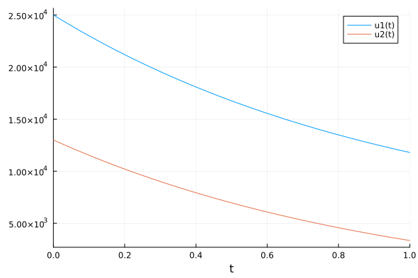
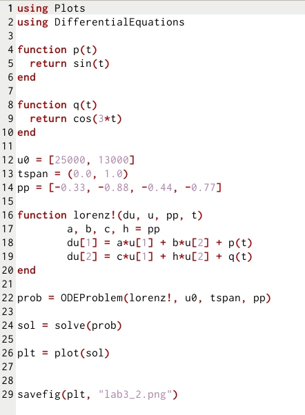
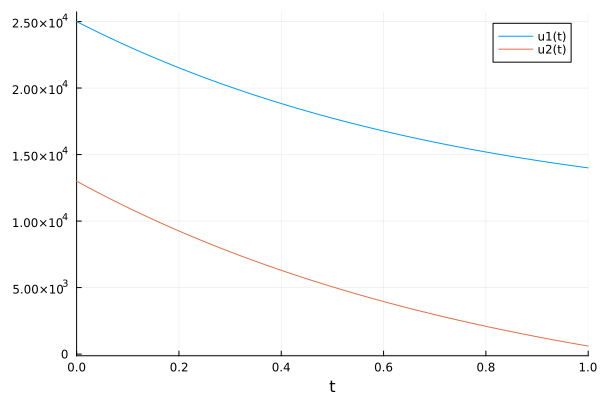
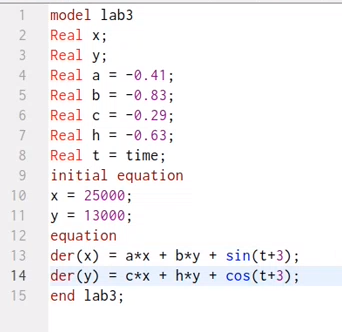
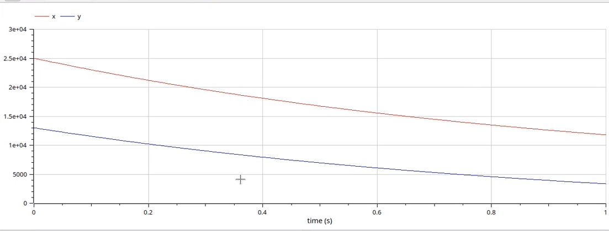
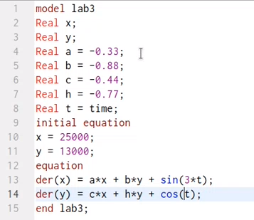
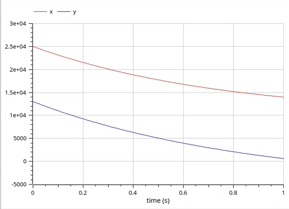

---
## Front matter
title: "Отчет лабораторной работы №3"
author: "Низамова Альфия Айдаровна"

## Generic otions
lang: ru-RU
toc-title: "Содержание"

## Bibliography
bibliography: bib/cite.bib
csl: pandoc/csl/gost-r-7-0-5-2008-numeric.csl

## Pdf output format
toc: true # Table of contents
toc-depth: 2
lof: true # List of figures
lot: true # List of tables
fontsize: 12pt
linestretch: 1.5
papersize: a4
documentclass: scrreprt
## I18n polyglossia
polyglossia-lang:
  name: russian
  options:
	- spelling=modern
	- babelshorthands=true
polyglossia-otherlangs:
  name: english
## I18n babel
babel-lang: russian
babel-otherlangs: english
## Fonts
mainfont: PT Serif
romanfont: PT Serif
sansfont: PT Sans
monofont: PT Mono
mainfontoptions: Ligatures=TeX
romanfontoptions: Ligatures=TeX
sansfontoptions: Ligatures=TeX,Scale=MatchLowercase
monofontoptions: Scale=MatchLowercase,Scale=0.9
## Biblatex
biblatex: true
biblio-style: "gost-numeric"
biblatexoptions:
  - parentracker=true
  - backend=biber
  - hyperref=auto
  - language=auto
  - autolang=other*
  - citestyle=gost-numeric
## Pandoc-crossref LaTeX customization
figureTitle: "Рис."
tableTitle: "Таблица"
listingTitle: "Листинг"
lofTitle: "Список иллюстраций"
lotTitle: "Список таблиц"
lolTitle: "Листинги"
## Misc options
indent: true
header-includes:
  - \usepackage{indentfirst}
  - \usepackage{float} # keep figures where there are in the text
  - \floatplacement{figure}{H} # keep figures where there are in the text
---

# Цель работы

Целью данной лабораторной работы является построение моделей боевых действий на языках программирования Julia и OpenModelica

# Задание
Между страной Х и страной У идет война. Численность состава войск
исчисляется от начала войны, и являются временными функциями
x(t) и y(t). В начальный момент времени страна Х имеет армию численностью 25 000 человек, а
в распоряжении страны У армия численностью в 13 000 человек. Для упрощения модели считаем, что коэффициенты a, b, c, h постоянны. Также считаем P(t) и Q(t) непрерывные функции.
Постройте графики изменения численности войск армии Х и армии У для следующих случаев:
1. Модель боевых действий между регулярными войсками: 
dx/dt = -0,41x(t)-0,83y(t)+sin(t+3)
dy/dt = -0,29x(t)-0,63y(x)+cos(t+3)
2. Модель ведение боевых действий с участием регулярных войск и
партизанских отрядов
dx/dt = -0,33x(t)-0,88y(t)+sin(t)
dy/dt = -0,44x(t)-0,77y(x)+cos(3t)

# Выполнение лабораторной работы
Написала код на языке Julia для модели боевых действий между регулярными войсками (рис.1)
{#fig:001 width=70%}

Результат выполнения программы(рис.2)
{#fig:001 width=70%}

Написала код на языке Julia для модели боевых действий с участием регулярных войск и партизанских отрядов (рис.3)
{#fig:001 width=70%}

Результат выполнения программы(рис.4)
{#fig:001 width=70%}

Написала код на яхыке OpenModelica для модели боевых действий между регулярными войсками (рис.1)
{#fig:001 width=70%}

Результат выполнения программы(рис.2)
{#fig:001 width=70%}

Написала код на языке OpenModelica для модели боевых действий с участием регулярных войск и партизанских отрядов (рис.3)
{#fig:001 width=70%}

Результат выполнения программы(рис.4)
{#fig:001 width=70%}

# Выводы

Я построила модель боевых действий на языках программирования Julia и OpenModelica

# Список литературы{.unnumbered}

::: {#refs}
:::
