---
## Front matter
lang: ru-RU
title: " Лабораторная работа №4"
author: |
	 "Низамова Альфия Айдаровна. НФИбд-01-20"\inst{1}

institute: |
	\inst{1}Российский Университет Дружбы Народов

date: 4 марта, 2023, Москва, Россия

## Formatting
mainfont: PT Serif
romanfont: PT Serif
sansfont: PT Sans
monofont: PT Mono
toc: false
slide_level: 2
theme: metropolis
header-includes: 
 - \metroset{progressbar=frametitle,sectionpage=progressbar,numbering=fraction}
 - '\makeatletter'
 - '\beamer@ignorenonframefalse'
 - '\makeatother'
aspectratio: 43
section-titles: true

---

# Цели и задачи работы

## Цель работы:

Целью данной лабораторной работы является ознакомление с моделью гармоничесих колебаний и построение их на языках программирования Julia и OpenModelica

# Задачи:

1. Изучить условие задачи
2. Написать код на языке программирования Julia для трех случаев 
3. Написать код на языке программирования OpenModelica для трех случаев
4. Изучить полученные графики

# Ход работы лабораторной работы

## Условие задачи:
Постройте фазовый портрет гармонического осциллятора и решение уравнения
гармонического осциллятора для следующих случаев
1. Колебания гармонического осциллятора без затуханий и без действий внешней
силы
x'' + 3x = 0
2. Колебания гармонического осциллятора c затуханием и без действий внешней
силы
x'' + x' + 4x = 0
3. Колебания гармонического осциллятора c затуханием и под действием внешней
силы
x'' + 2x' + x = sin(2t)

На интервале
t от 0 до 40
(шаг 0.05) с начальными условиями
x0 = 1, y0 = 1

## 1 случай

Написала код на языке Julia 
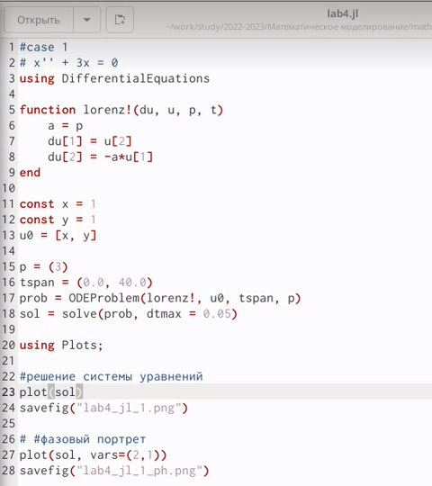{#fig:001 width=70%}

## 1 случай

Решение  уравнения
гармонического осциллятора для 1 случая
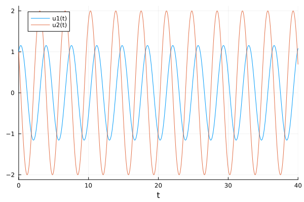{#fig:001 width=70%}

## 1 случай

Фазовый портрет гармонического осциллятора
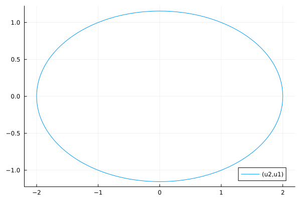{#fig:001 width=70%}

## 1 случай

Написала код на языке OpenModelica 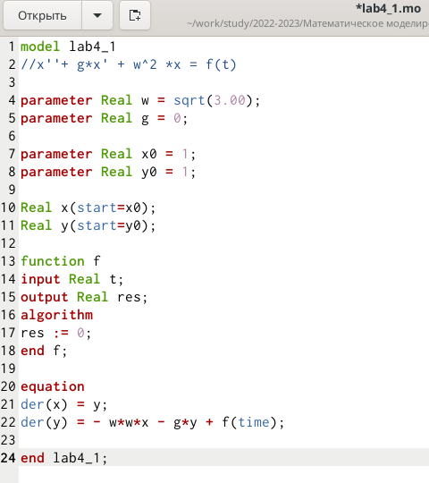{#fig:001 width=70%}

## 1 случай 
Решение  уравнения
гармонического осциллятора для 1 случая
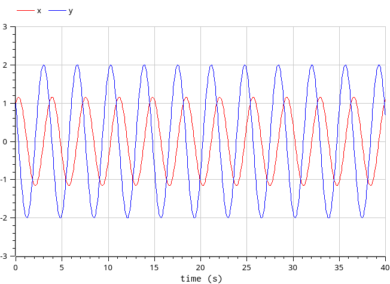{#fig:001 width=70%}

## 1 случай

Фазовый портрет гармонического осциллятора
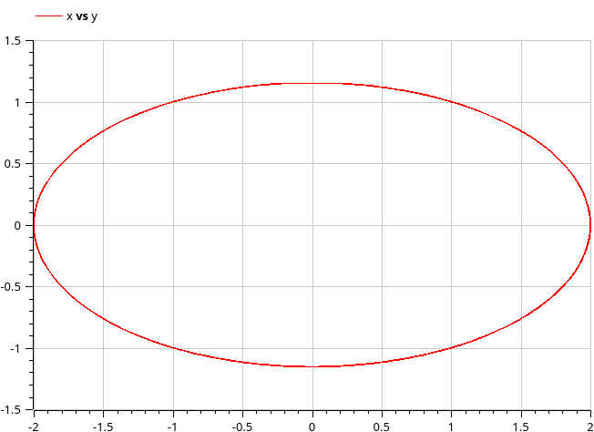{#fig:001 width=70%}

## 2 случай

Написала код на языке Julia 
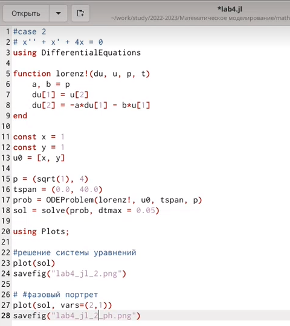{#fig:001 width=70%}

## 2 случай

Решение  уравнения
гармонического осциллятора для 2 случая
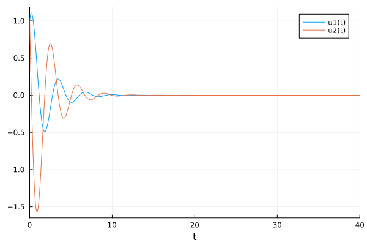{#fig:001 width=70%}

## 2 случай

Фазовый портрет гармонического осциллятора
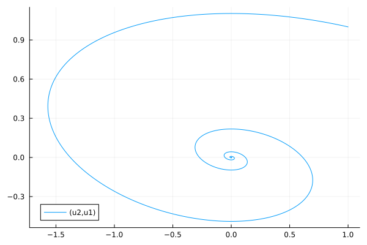{#fig:001 width=70%}

## 2 случай

Написала код на языке OpenModelica 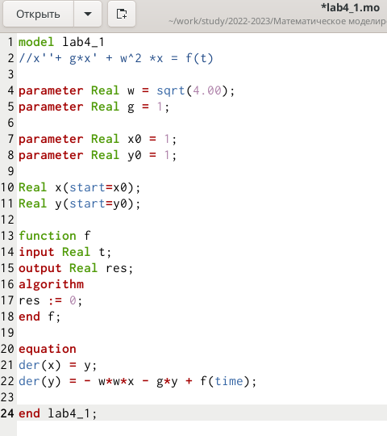{#fig:001 width=70%}

## 2 случай 
Решение  уравнения
гармонического осциллятора для 2 случая
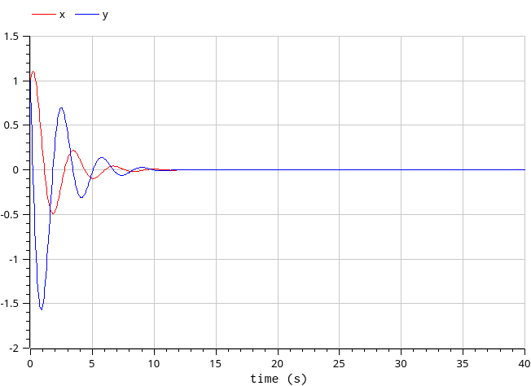{#fig:001 width=70%}

## 2 случай

Фазовый портрет гармонического осциллятора
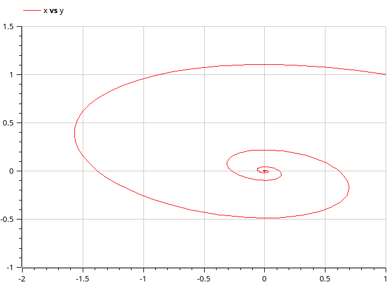{#fig:001 width=70%}

## 3 случай

Написала код на языке Julia 
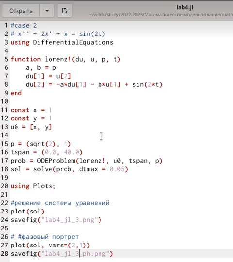{#fig:001 width=70%}

## 3 случай

Решение  уравнения
гармонического осциллятора для 3 случая
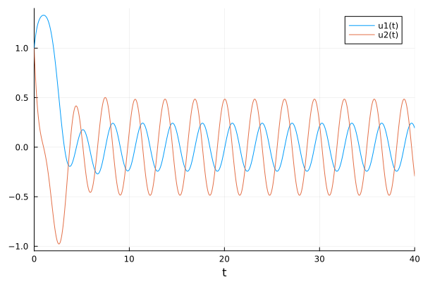{#fig:001 width=70%}

## 3 случай

Фазовый портрет гармонического осциллятора
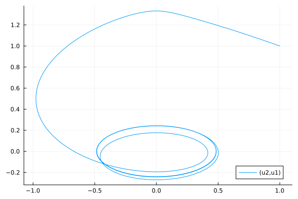{#fig:001 width=70%}

## 3 случай

Написала код на языке OpenModelica 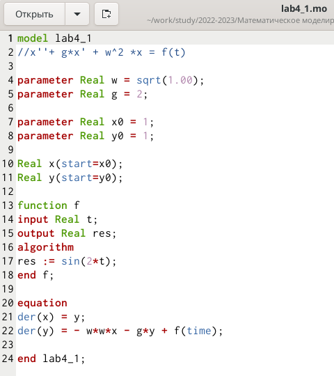{#fig:001 width=70%}

## 3 случай 
Решение  уравнения
гармонического осциллятора для 3 случая
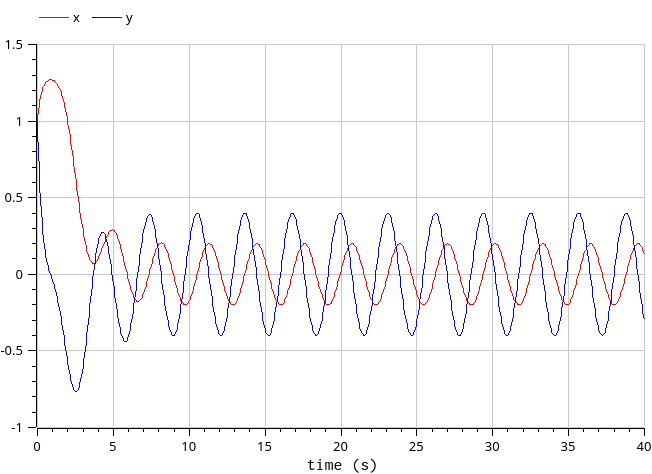{#fig:001 width=70%}

## 3 случай

Фазовый портрет гармонического осциллятора
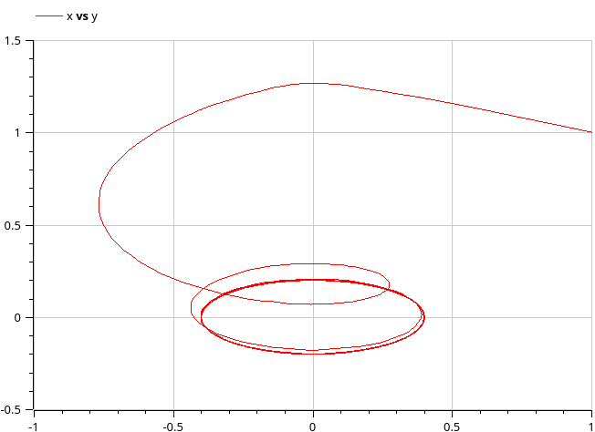{#fig:001 width=70%}

# Выводы
В ходе лабораторной работы нам удалось ознакомиться с моделью гармоничесих колебаний и построить их на языках программирования Julia и OpenModelica
