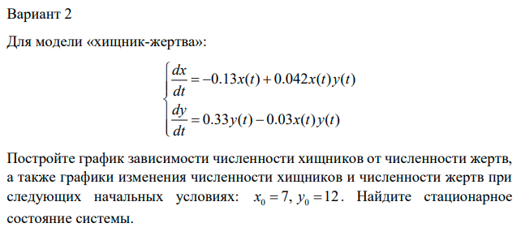
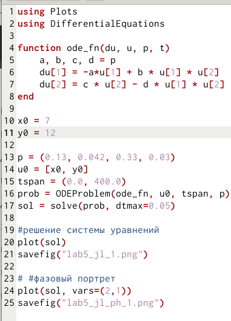
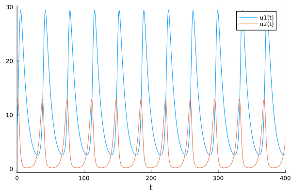
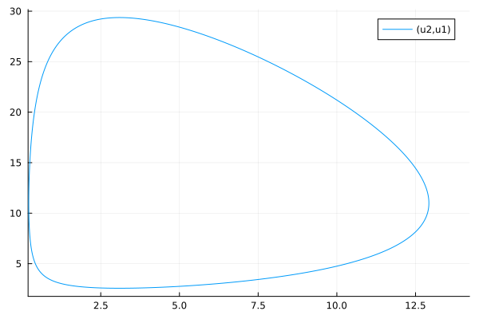
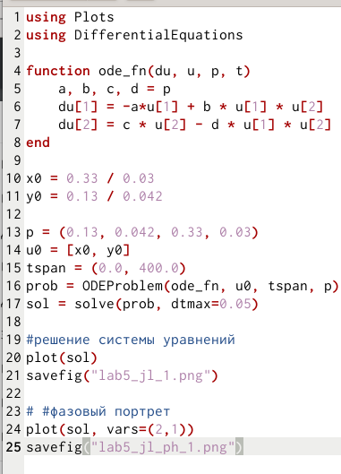
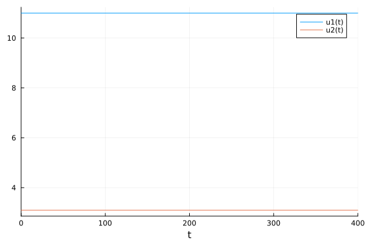
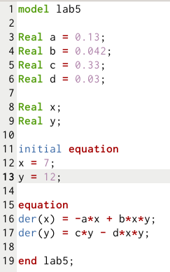
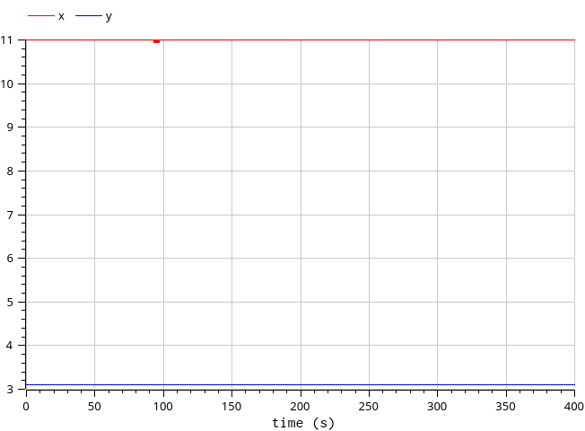
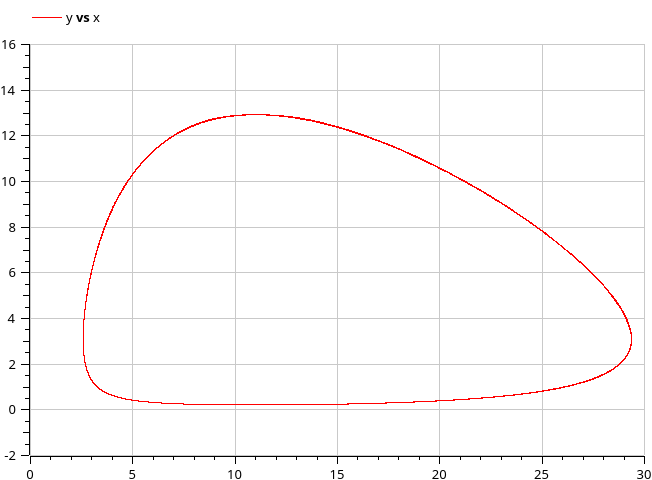
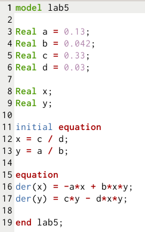

---
## Front matter
lang: ru-RU
title: " Лабораторная работа №5"
author: |
	 "Низамова Альфия Айдаровна. НФИбд-01-20"\inst{1}

institute: |
	\inst{1}Российский Университет Дружбы Народов

date: 4 марта, 2023, Москва, Россия

## Formatting
mainfont: PT Serif
romanfont: PT Serif
sansfont: PT Sans
monofont: PT Mono
toc: false
slide_level: 2
theme: metropolis
header-includes: 
 - \metroset{progressbar=frametitle,sectionpage=progressbar,numbering=fraction}
 - '\makeatletter'
 - '\beamer@ignorenonframefalse'
 - '\makeatother'
aspectratio: 43
section-titles: true

---

# Цели и задачи работы

## Цель работы:

Целью данной лабораторной работы является ознакомление с моделью Лотки-Вольтерры и построение его на языках программирования Julia и OpenModelica

# Задачи:

1. Изучить условие задачи
2. Написать код на языке программирования Julia и найти стационарное состояние 
3. Написать код на языке программирования OpenModelica и найти стационарное состояние
4. Изучить полученные графики

# Ход работы лабораторной работы

## Условие задачи:
Задание(рис.1)

## Julia

Написала код на языке Julia и Openmodelica для построния графика зависимости численности хищников от численности жертв,
а также графики изменения численности хищников и численности жертв при
следующих начальных условиях:
x0 = 7, y0 = 12     

Код на Julia(рис.2)
{#fig:001 width=70%}

## Julia

{#fig:001 width=70%}

{#fig:001 width=70%}

## Julia

Стационарное состояние на Julia
{#fig:001 width=70%}

{#fig:001 width=70%}

## OpenModelica

Написала код на языке OpenModelica Код на OpenModelica(рис.2)
{#fig:001 width=70%}

## OpenModelica 
{#fig:001 width=70%}

{#fig:001 width=70%}

## OpenModelica 

Стационарное состояние на OpenModelica
{#fig:001 width=70%}

{#fig:001 width=70%}

# Выводы
Мы ознакомились с моделью Лотки-Вольтерры и построили его на языках программирования Julia и OpenModelica
