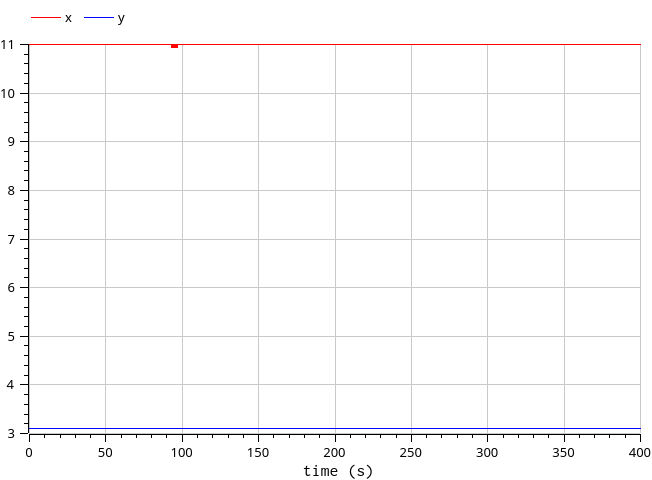

---
## Front matter
title: "Отчет лабораторной работы №5"
author: "Низамова Альфия Айдаровна"

## Generic otions
lang: ru-RU
toc-title: "Содержание"

## Bibliography
bibliography: bib/cite.bib
csl: pandoc/csl/gost-r-7-0-5-2008-numeric.csl

## Pdf output format
toc: true # Table of contents
toc-depth: 2
lof: true # List of figures
lot: true # List of tables
fontsize: 12pt
linestretch: 1.5
papersize: a4
documentclass: scrreprt
## I18n polyglossia
polyglossia-lang:
  name: russian
  options:
	- spelling=modern
	- babelshorthands=true
polyglossia-otherlangs:
  name: english
## I18n babel
babel-lang: russian
babel-otherlangs: english
## Fonts
mainfont: PT Serif
romanfont: PT Serif
sansfont: PT Sans
monofont: PT Mono
mainfontoptions: Ligatures=TeX
romanfontoptions: Ligatures=TeX
sansfontoptions: Ligatures=TeX,Scale=MatchLowercase
monofontoptions: Scale=MatchLowercase,Scale=0.9
## Biblatex
biblatex: true
biblio-style: "gost-numeric"
biblatexoptions:
  - parentracker=true
  - backend=biber
  - hyperref=auto
  - language=auto
  - autolang=other*
  - citestyle=gost-numeric
## Pandoc-crossref LaTeX customization
figureTitle: "Рис."
tableTitle: "Таблица"
listingTitle: "Листинг"
lofTitle: "Список иллюстраций"
lotTitle: "Список таблиц"
lolTitle: "Листинги"
## Misc options
indent: true
header-includes:
  - \usepackage{indentfirst}
  - \usepackage{float} # keep figures where there are in the text
  - \floatplacement{figure}{H} # keep figures where there are in the text
---

# Цель работы

Целью данной лабораторной работы является ознакомление с моделью Лотки-Вольтерры и построение его на языках программирования Julia и OpenModelica

# Задание
Задание(рис.1)
{#fig:001 width=70%}
# Выполнение лабораторной работы
Написала код на языке Julia и Openmodelica для построния графика зависимости численности хищников от численности жертв,
а также графики изменения численности хищников и численности жертв при
следующих начальных условиях:
x0 = 7, y0 = 12     

Код на Julia(рис.2)
{#fig:001 width=70%}

{#fig:001 width=70%}

{#fig:001 width=70%}

Стационарное состояние на Julia
{#fig:001 width=70%}

{#fig:001 width=70%}

Код на OpenModelica(рис.2)
{#fig:001 width=70%}

{#fig:001 width=70%}

{#fig:001 width=70%}

Стационарное состояние на OpenModelica
{#fig:001 width=70%}

{#fig:001 width=70%}

# Выводы

Мы ознакомились с моделью Лотки-Вольтерры и построили его на языках программирования Julia и OpenModelica

# Список литературы{.unnumbered}

::: {#refs}
:::
